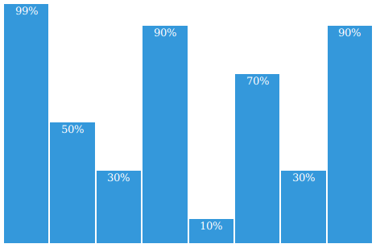
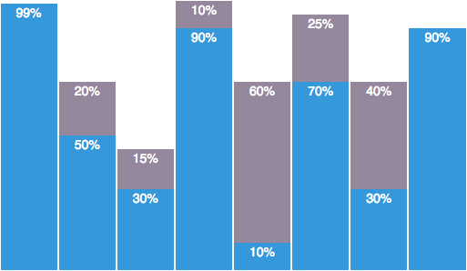
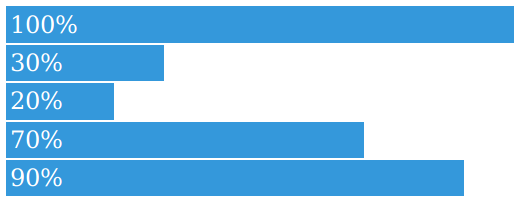

cssplot
=======

Simple, css-only plotting.

## Features

 * No javascript required
 * Easy-to-use
 * Responsive

Check [asciimoo.github.io/cssplot](https://asciimoo.github.io/cssplot) for demo.

## Usage

```html
<link media="all" rel="stylesheet" type="text/css" href="/build/cssplot.full.css" />
```

Alternatively `cssplot.base.css` can be used alone with the following modifications:

 * Bar chart: use `class="chart-column" style="height: 99.0%"` instead of `data-cp-size="99"`
 * Vertical bar chart: use `class="chart-row" style="width: 99.0%"` instead of `data-cp-size="99"`
 * Scatter plot: use `class="chart-dot" style="left: 20.0%; bottom: 10.0%"` instead of `data-cp-x="20" data-cp-y="10"`

## Examples

### Column chart

```html
<div class="column-chart">
    <ul class="plot-container">
        <li data-cp-size="99">99%</li>
        <li data-cp-size="50">50%</li>
        <li data-cp-size="30">30%</li>
        <li data-cp-size="90">90%</li>
        <li data-cp-size="10">10%</li>
        <li data-cp-size="70">70%</li>
        <li data-cp-size="30">30%</li>
        <li data-cp-size="90">90%</li>
    </ul>
</div>
```

<div align="center">
  
</div>

### Stacked Column chart

```html
<div class="column-chart stacked">
  <ul class="plot-container group-by-number">
    <li>
      <div data-cp-size="99">99%</div>
    </li>
    <li>
      <div data-cp-size="50">50%</div>
      <div data-cp-size="20" data-group="5">20%</div>
    </li>
    <li>
      <div data-cp-size="30">30%</div>
      <div data-cp-size="15" data-group="5">15%</div>
    </li>
    <li>
      <div data-cp-size="90">90%</div>
      <div data-cp-size="10" data-group="5">10%</div>
    </li>
    <li>
      <div data-cp-size="10">10%</div>
      <div data-cp-size="60" data-group="5">60%</div>
    </li>
    <li>
      <div data-cp-size="70">70%</div>
      <div data-cp-size="25" data-group="5">25%</div>
    </li>
    <li>
      <div data-cp-size="30">30%</div>
      <div data-cp-size="40" data-group="5">40%</div>
    </li>
    <li>
      <div data-cp-size="90">90%</div>
    </li>
  </ul>
</div>
```

<div align="center">
  
</div>

### Bar chart

```html
<div class="bar-chart">
    <ul class="plot-container">
        <li data-cp-size="100">100%</li>
        <li data-cp-size="30">30%</li>
        <li data-cp-size="20">20%</li>
        <li data-cp-size="70">70%</li>
        <li data-cp-size="90">90%</li>
    </ul>
</div>
```

<div align="center">
  
</div>

### Stacked Bar chart

```html
<div class="bar-chart stacked pad">
    <ul class="plot-container group-by-number">
        <li>
            <div data-cp-size="100">100%</div>
        </li>
        <li>
            <div data-cp-size="30">30%</div>
            <div data-cp-size="30" data-group="5">30%</div>
        </li>
        <li>
            <div data-cp-size="20">20%</div>
            <div data-cp-size="50" data-group="5">50%</div>
        </li>
        <li>
            <div data-cp-size="70">70%</div>
            <div data-cp-size="20" data-group="5">20%</div>
        </li>
        <li>
            <div data-cp-size="90">90%</div>
            <div data-cp-size="10" data-group="5">10%</div>
        </li>
    </ul>
</div>
```

<div align="center">
  
</div>

### Scatter plot

```html
<div class="scatter-plot">
    <ul class="plot-container">
        <li data-cp-x="50" data-cp-y="30">a</li>
        <li data-cp-x="30" data-cp-y="20">b</li>
        <li data-cp-x="10" data-cp-y="5">c</li>
        <li data-cp-x="11" data-cp-y="10">d</li>
        <li data-cp-x="12" data-cp-y="20">e</li>
        <li data-cp-x="13" data-cp-y="30">f</li>
        <li data-cp-x="0" data-cp-y="0">h</li>
        <li data-cp-x="100" data-cp-y="100">i</li>
    </ul>
</div>
```

<div align="center">
  
</div>

## Conceptions

- [ ] Pie chart
- [ ] Line chart
- [ ] Axis/scale support
- [ ] Live demo
- [ ] Better build script
