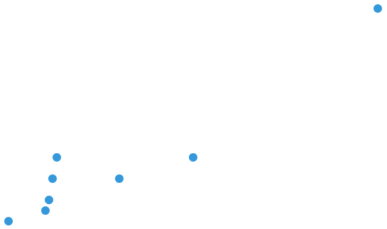

cssplot
=======

Simple, css-only plotting.


### Features

 * No javascript required
 * Easy-to-use
 * Responsive


### Examples

bar chart

```html
<div class="bar-chart">
    <ul>
        <li data-cssplot-size="99">99%</li>
        <li data-cssplot-size="50">50%</li>
        <li data-cssplot-size="30">30%</li>
        <li data-cssplot-size="90">90%</li>
        <li data-cssplot-size="10">10%</li>
        <li data-cssplot-size="70">70%</li>
        <li data-cssplot-size="30">30%</li>
        <li data-cssplot-size="90">90%</li>
    </ul>
</div>
```


vertical chart

```html
<div class="vertical-chart">
    <ul>
        <li data-cssplot-size="100">100%</li>
        <li data-cssplot-size="30">30%</li>
        <li data-cssplot-size="20">20%</li>
        <li data-cssplot-size="70">70%</li>
        <li data-cssplot-size="90">90%</li>
    </ul>
</div>
```


scatterplot

```html
<div class="scatterplot">
    <ul>
        <li data-cssplot-x="50" data-cssplot-y="30">a</li>
        <li data-cssplot-x="30" data-cssplot-y="20">b</li>
        <li data-cssplot-x="10" data-cssplot-y="5">c</li>
        <li data-cssplot-x="11" data-cssplot-y="10">d</li>
        <li data-cssplot-x="12" data-cssplot-y="20">e</li>
        <li data-cssplot-x="13" data-cssplot-y="30">f</li>
        <li data-cssplot-x="0" data-cssplot-y="0">h</li>
        <li data-cssplot-x="100" data-cssplot-y="100">i</li>
    </ul>
</div>
```


